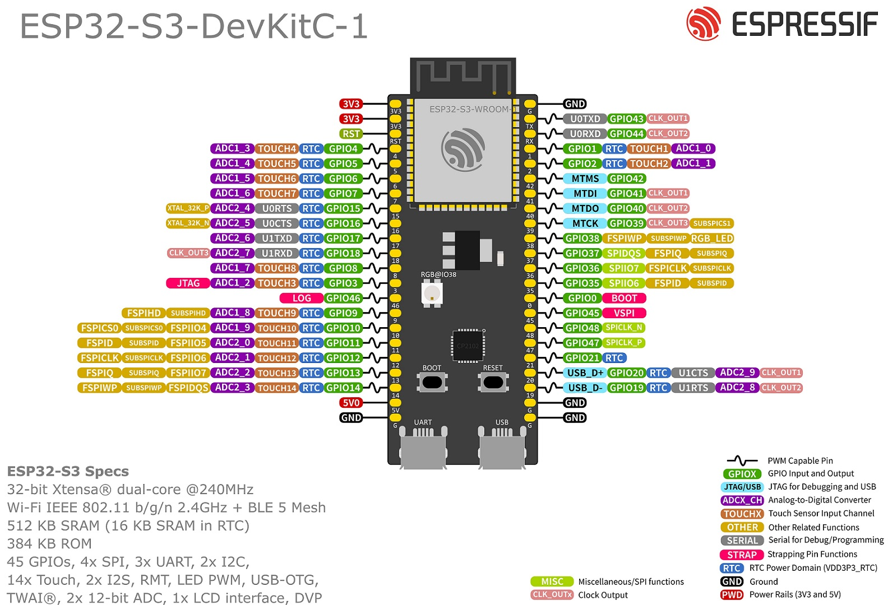

## Gerar e Manipular PWM

[Documentação LEDC Espressif](https://docs.espressif.com/projects/arduino-esp32/en/latest/api/ledc.html)

### Pinout Controlador

[Datasheet SoC](./esp32-s3_datasheet_en.pdf)

[Datasheet Module](datasheetESP32-S3-WROOM-1.pdf)
